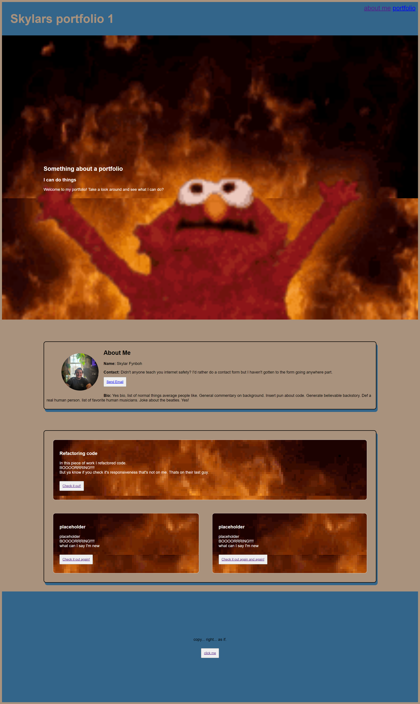
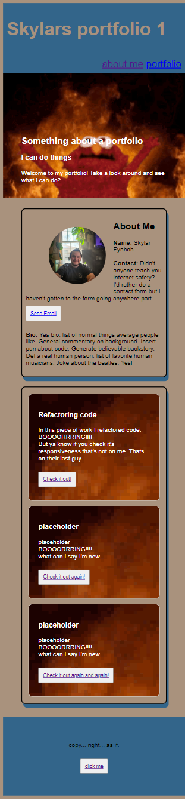

# Portfolio

## Description

This portfolio offers a glimpse into the talents offered by me, Sky. While there are many portfolio's like it this one is mine. Within the site you will be able to veiw a sample and placeholder application, god forbid contact an example email, and learn a brief bit about a real human person. In addition to this, you'll also be linked to a brief video YOU CANT AFFORD TO MISS!


## Usage

Basically just scroll and click things I guess. It's fairly responsive? Check that out I guess?

    ```md
    
    ```
    
    ```md
    
    ```  

## Credits

I'd like to credit W3Schools.com,mdn reference, for giving me lots of inspiration and help when I was confused. Without being able to deconstruct and draw inspiration from them I would have never been able to finish this in time. 

## License

as this is a homework assignment, I'm not going to put a license in here, if anyone decides they want to use anything I'd probably laugh and say why but like idk I don't think anyone wants to use it, and i'm not going to go after anyone using it.


## Features

It's responsive and kinda funny i guess, but it's a very basic project and kinda bad.

## How to Contribute

you probably don't want to touch this dumpster fire. come back on v3.

## Tests

I dunno man just mess around and stuff.
